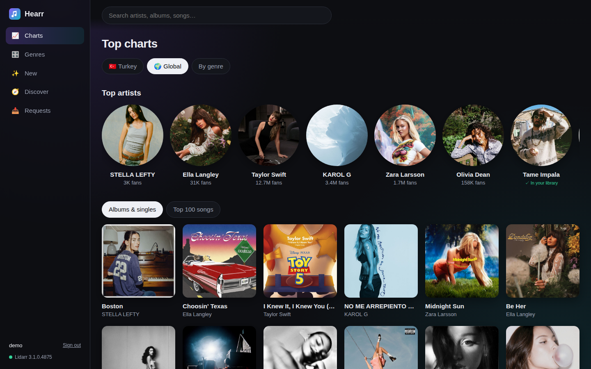
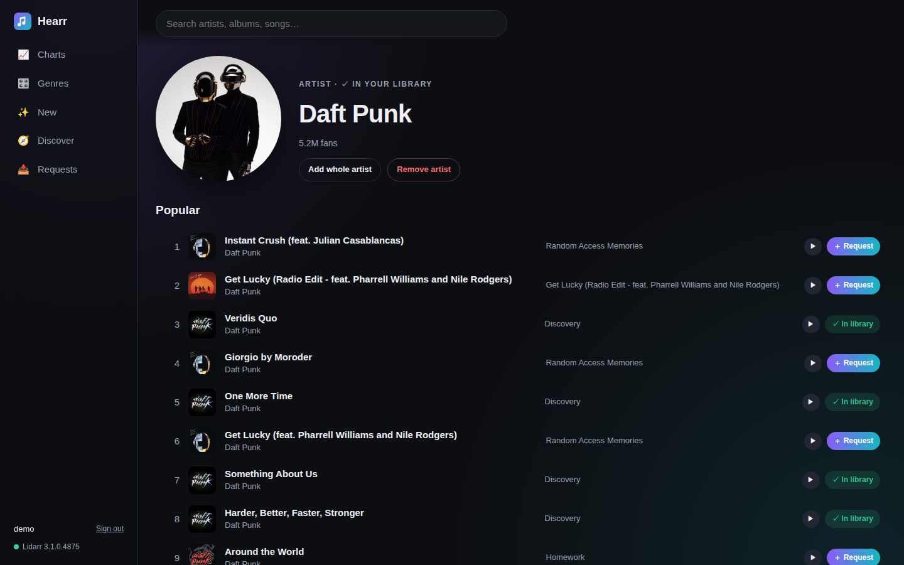
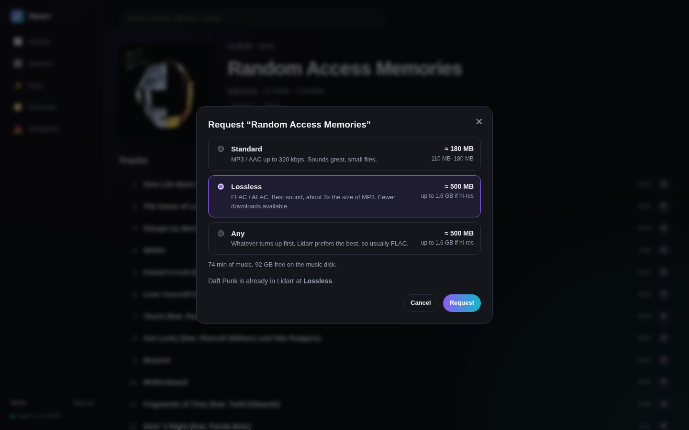
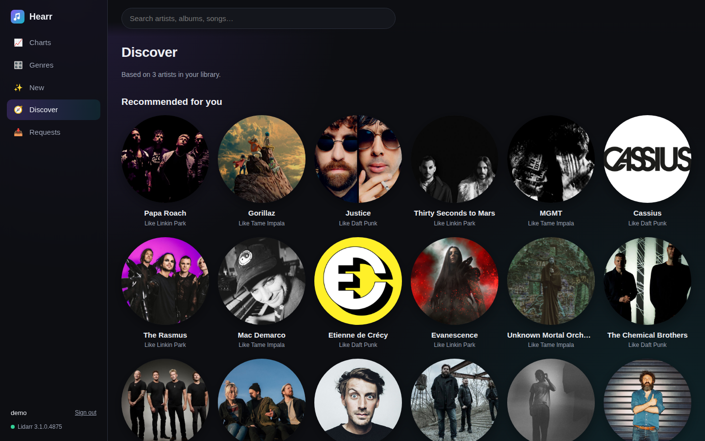

<p align="center">
  
</p>

<h1 align="center">Hearr</h1>

<p align="center">
  Music discovery for <a href="https://lidarr.audio">Lidarr</a>.<br>
  Browse the charts, find artists like the ones you already have, preview songs, and send
  albums to Lidarr with one click.
</p>

<p align="center">
  
</p>

## Features

- **Charts:** Deezer's Top 100 for the countries you choose, shown as albums & singles or as a song list.
- **Genres:** top albums, artists and songs per genre.
- **New:** recent releases from artists already in your Lidarr library, plus Deezer's editorial picks.
- **Discover:** artists similar to your library, ranked by how many of your artists they're related to.
- **Search, artist and album pages:** full discographies (albums, EPs, singles) and 30-second previews.
- **One-click requests:** pick a quality (Lidarr's quality profiles) and see the estimated download size and free disk space before you request.
- **Library status everywhere:** *In library*, *Downloading*, *Searching* or *Search now* for albums Lidarr wants but isn't looking for.
- **Remove:** stop Lidarr wanting an album, delete its files and (optionally) its seeding torrent.
- **Sign in with Plex:** only accounts that can access your Plex server get in.
- Works on phones, and no API keys are needed for the music data.

| Artist | Request | Discover |
|---|---|---|
|  |  |  |

## How it works

Music data comes from Deezer's public API. Requests go to your Lidarr through its API, which uses
Lidarr's own metadata server, so Hearr never talks to MusicBrainz directly.

When you request an album, Hearr:

1. matches the Deezer release to Lidarr's metadata. Titles are compared after removing edition and
   "feat." markers and folding accents.
   - Confident match (score ≥ 0.9): requested straight away.
   - Close (0.6–0.9): you pick the right release from a short list.
   - Otherwise it tells you Lidarr doesn't have it yet. That's common for brand-new singles.
2. adds the artist to Lidarr **without monitoring anything else**, waits for Lidarr's artist refresh
   to finish, then monitors and searches just that album. If the artist is already there, it
   monitors and searches the album.

**Add whole artist** adds the artist with every album monitored and searches for all of them.

Quality is set per artist in Lidarr, so for an artist you already have, changing the quality in the
picker applies to all of their albums. The picker warns you about this.

**Size estimates** are album length × a typical bitrate (320 kbps for MP3/AAC, ~900 kbps for FLAC,
~2800 kbps for 24-bit hi-res). In practice they land within about 15% of the real download.

## Requirements

- Lidarr v2 or newer, reachable from the Hearr container.
- A Plex server, used for sign-in only. Your music doesn't have to be in Plex.
- Optional: qBittorrent, so that **Remove** can also delete the seeding torrent.

## Quick start

```sh
mkdir hearr && cd hearr
curl -L -o docker-compose.yml https://raw.githubusercontent.com/OWNER/hearr/main/docker-compose.example.yml
curl -L -o .env https://raw.githubusercontent.com/OWNER/hearr/main/.env.example
# fill in .env, adjust the environment section, then:
docker compose up -d
```

Open `http://<host>:5070` and sign in with Plex.

Your Plex server's ID (`PLEX_SERVER_ID`) is the `machineIdentifier` in:

```sh
curl -s http://<plex-host>:32400/identity
```

If Lidarr runs in another compose project, put Hearr on the same Docker network or use the host's
address in `LIDARR_URL`.

On first start Hearr creates a Lidarr **metadata profile** called `Hearr` (Albums, EPs and Singles;
studio, official releases). Chart hits are mostly singles, and Lidarr's default profile hides them.
Only artists added through Hearr use it.

## Configuration

| Variable | Default | |
|---|---|---|
| `LIDARR_URL` | `http://lidarr:8686` | Lidarr as seen from the container |
| `LIDARR_API_KEY` | | **Required.** Lidarr → Settings → General |
| `LIDARR_PUBLIC_URL` | `LIDARR_URL` | Link to Lidarr shown in the UI |
| `LIDARR_ROOT_FOLDER` | `/data/Music` | Lidarr root folder for new artists |
| `LIDARR_QUALITY_PROFILE` | `Standard` | Default quality in the picker |
| `LIDARR_METADATA_PROFILE` | `Hearr` | Metadata profile for new artists (created if missing) |
| `PLEX_SERVER_ID` | | **Required.** Users must have access to this Plex server |
| `CHARTS` | `global,us,uk` | Chart tabs, in order (see below) |
| `NEW_RELEASE_DAYS` | `120` | How far back **New** looks |
| `QBITTORRENT_URL` | | Enables deleting seeding torrents on **Remove** |
| `QBITTORRENT_USER` / `QBITTORRENT_PASSWORD` | `admin` / | qBittorrent Web UI login |
| `QBITTORRENT_CATEGORY` | `music` | Only torrents in this category are ever deleted |
| `COOKIE_SECURE` | `false` | Set to `true` when Hearr is served over HTTPS |
| `DATA_DIR` | `/data` | Request history and sessions (SQLite) |

### Charts

`CHARTS` is a comma-separated list of built-in country codes (`global`, `us`, `uk`, `fr`, `de`,
`es`, `it`, `br`, `co`, `tr`) and/or any Deezer playlist as `Label=playlistID`:

```
CHARTS=tr,global,Chill=1234567890
```

Deezer publishes a "Top &lt;country&gt;" playlist (by *Deezer Charts*) for most countries. Search
for it on deezer.com and copy the number from its URL.

## Sign-in and permissions

Everything except `/api/health` needs a session. Users sign in with Plex (Plex's PIN flow). An
account is allowed if Plex lists your server among its resources, which means the owner and
everyone the server is shared with. Sessions last 30 days. Requests record who made them.

- Everyone who can sign in can browse and request.
- Only the **server owner** can remove albums or artists.

Hearr is meant for your home network or a VPN (Tailscale, WireGuard). If you expose it to the
internet, put it behind HTTPS and set `COOKIE_SECURE=true`.

## Removing music

**Remove** on an album page unmonitors the album, cancels active downloads and deletes its files.
If `QBITTORRENT_*` is set, it also deletes the seeding torrent (with its data), unless another album
that still has files came from the same torrent. If the artist is left with nothing, they are
removed from Lidarr too. **Remove artist** deletes the artist with all their files and torrents.

## Development

```sh
python3 -m venv .venv && .venv/bin/pip install -r requirements.txt pytest
.venv/bin/python -m pytest tests
LIDARR_URL=http://localhost:8686 LIDARR_API_KEY=... PLEX_SERVER_ID=... DATA_DIR=./data \
  .venv/bin/uvicorn app.main:app --reload --port 5070
```

The backend is FastAPI (`app/`). The frontend is plain HTML/CSS/JS with no build step
(`app/static/`). Port 5070 is used because browsers refuse to open 5060 (the SIP port).

## Notes

- Hearr doesn't host or download anything itself. It asks your Lidarr to. Use it with content you
  have the right to download.
- Music data and 30-second previews come from the [Deezer API](https://developers.deezer.com).
  Hearr isn't affiliated with Deezer, Lidarr or Plex.

## License

[MIT](LICENSE)
